# GeoMx: Dataset setup and QC
### Author: Diana Vera Cruz
### Date: 03/31/2025

## Introduction

This tutorial was created to provide a step-by-step guide on how to set
up a dataset for GeoMx analysis. This tutorial was inspired in the
[GeoMxTools
Tutorial](https://www.bioconductor.org/packages/release/workflows/vignettes/GeoMxWorkflows/inst/doc/GeomxTools_RNA-NGS_Analysis.html),
which also uses this dataset. The tutorial will cover the following
steps:

1.  Load and process the raw data

2.  Perform quality control (QC) analysis

3.  Generate a dataset object for downstream analysis

### Dataset

FFPE and FF tissue sections from 4 diabetic kidney disease (DKD) and 3
healthy kidney sections [Merritt et al.,
2020](https://pubmed.ncbi.nlm.nih.gov/32393914/), processed using the
GeoMx Digital Spatial Profiler (DSP) platform. The ROI were profiled to
focus on tubules or glomeruli regions.

- Glomeruli: Each ROIs defined as glomeruli contains a single
  glomerulus.

- Tubular: Each ROI contains multiple tubules, and are further
  classified into distal (PanCK+) or proximal (PanCK-) AOIs.

**For the purposes of the tutorial, we simulated 3 columns: Number of
nuclei, and X and Y coordinate per ROI, since the initial data did not
have this fields.**

## Raw data

To generate the complete dataset object we will need 3 types of files:

1.  **Annotation file**: Excel table with metadata information about
    each ROI and segment.

2.  **DCC files**: Expression count data and sequencing quality data:
    One file per segment (ROI, AOI).

3.  **PKC files**: Probes / genes level information. Normally is just
    one, for the organism of reference.

### Considerations prior data loading

One of the key issues when loading the data is missing information from
the segments metadata. This is normally is due to the fact that the
columns are not named as expected. upper or lower case seems to work,
but you can try various alternatives to make sure this data is
available. Make sure you have columns for:

- Sample_ID: Unique identifier for each segment, this also match the DCC
  files names.
- Slide:
- ROI: ROI or roi is a good option.
- AOI: AOI or aoi is a good option.
- Area: Area of the segment. area, segment_area, etc.
- Nuclei: Number of nuclei in the segment.
- Coordinate_X/Y: X and Y coordinates of the segment, needed for spatial
  analysis (SpatialExperiment objects, Seurat, etc)

Since various of these columns are used for the QC, it is important to
have them available, you can notice if they are correct or not in the QC
parameters table that defines whether a segment passes or not the QC for
each of the parameters. Other columns will be added in the final object
and come from the DCC themselves.

## Loading data

``` r
knitr::opts_chunk$set(message = FALSE)
## LIBRARIES
## Libraries can be installed through Bioconductor: BicManager::install("package_name")
library("tidyverse")
library("readxl")
library("GeomxTools") 
library("SpatialExperiment")
library("ggalluvial")

## Create output directories. 
out_dir = '..' ## Or full path for the desired output directory.
if(!dir.exists(file.path(out_dir, 'env'))) dir.create( file.path(out_dir, 'env') )
if(!dir.exists(file.path(out_dir, 'results'))) dir.create(file.path(out_dir, 'results') )
tab_format = "markdown" ## or 
```

### Raw data: DCC, PKC and annotation

Within the annotation excel, make sure you have the columns needed as
metadata for the segments: ROI/AOIs. In this case, the columns with
relevant information are region, segment and class.

``` r
## DCC files. 
dcc_dir = '../Kidney_Dataset/dccs'
DCC_files <- list.files(dcc_dir, pattern = ".dcc", full.names = TRUE)
length(DCC_files)
```

    ## [1] 236

``` r
DCC_files[1:5]
```

    ## [1] "../Kidney_Dataset/dccs/DSP-1001250007851-H-A02.dcc" "../Kidney_Dataset/dccs/DSP-1001250007851-H-A03.dcc"
    ## [3] "../Kidney_Dataset/dccs/DSP-1001250007851-H-A04.dcc" "../Kidney_Dataset/dccs/DSP-1001250007851-H-A05.dcc"
    ## [5] "../Kidney_Dataset/dccs/DSP-1001250007851-H-A06.dcc"

``` r
## PKC file: Make sure it is unzipped. 
PKC_file <- "../Kidney_Dataset/pkcs/Hs_R_NGS_WTA_v1.0.pkc"

## Annotation file: 
annotation_file <- '../Kidney_Dataset/kidney_demo_AOI_Annotations_tidy.xlsx'
## Check that the annotation file has rows that match the names in the DCC files vector. 
## Also, there has to be a firs line for the negative control. 
read_excel(annotation_file) %>% head %>% str
```

    ## tibble [6 × 17] (S3: tbl_df/tbl/data.frame)
    ##  $ Sample_ID       : chr [1:6] "DSP-1001250007851-H-A02" "DSP-1001250007851-H-A03" "DSP-1001250007851-H-A04" "DSP-1001250007851-H-A05" ...
    ##  $ construct       : chr [1:6] "directPCR" "directPCR" "directPCR" "directPCR" ...
    ##  $ instrument_type : chr [1:6] "NextSeq" "NextSeq" "NextSeq" "NextSeq" ...
    ##  $ read_pattern    : chr [1:6] "2x27" "2x27" "2x27" "2x27" ...
    ##  $ expected_neg    : num [1:6] 0 0 0 0 0 0
    ##  $ panel           : chr [1:6] "WTX" "WTX" "WTX" "WTX" ...
    ##  $ slide_name      : chr [1:6] "disease3" "disease3" "disease3" "disease3" ...
    ##  $ class           : chr [1:6] "DKD" "DKD" "DKD" "DKD" ...
    ##  $ roi             : num [1:6] 7 8 9 10 11 12
    ##  $ segment         : chr [1:6] "Geometric Segment" "Geometric Segment" "Geometric Segment" "Geometric Segment" ...
    ##  $ aoi             : chr [1:6] "Geometric Segment-aoi-001" "Geometric Segment-aoi-001" "Geometric Segment-aoi-001" "Geometric Segment-aoi-001" ...
    ##  $ area            : num [1:6] 31798 16920 14312 20033 27583 ...
    ##  $ region          : chr [1:6] "glomerulus" "glomerulus" "glomerulus" "glomerulus" ...
    ##  $ pathology       : chr [1:6] "abnormal" "abnormal" "abnormal" "abnormal" ...
    ##  $ nuclei          : num [1:6] 225 132 114 89 132 169
    ##  $ ROI_Coordinate_X: num [1:6] 89.1 237.7 174 184.3 374.3 ...
    ##  $ ROI_Coordinate_Y: num [1:6] 108.4 124.2 167.8 69.4 177.3 ...

``` r
## Define which are the columns of interest to keep in metadata tables 
meta_cols <- c('Sample_ID', 'slide_name', 'region', 'segment', 'class', 'aoi', 'roi', 'area', 'nuclei', 'pathology', 'ROI_Coordinate_X', 'ROI_Coordinate_Y')
```

``` r
geomxdt <- readNanoStringGeoMxSet(dccFiles = DCC_files, 
                                  pkcFiles = PKC_file, 
                                  phenoDataFile = annotation_file, 
                                  phenoDataSheet = 'Sheet1', ## Sheet name in excel annotation file. 
                                  phenoDataDccColName = 'Sample_ID',
                                  protocolDataColNames = c('aoi','roi'),
                                  experimentDataColNames = c('panel')
                                  )
## Save object. 
saveRDS(geomxdt, file = file.path(out_dir,'env/geomxdt_raw.RDS'))
```

### NanoStringGeoMxSet object

The object is a `NanoStringGeoMxSet` object, which is a subclass of
`SummarizedExperiment`. The object contains various slots, the most
relevant are:

- `pData`: Contains the metadata information per segment. pData(geomxdt)

- `sData`: Contains the extended version of the metadata, protocol and
  other general information of the study present in the annotation file.

- `protocolData`: Contains all the metadata for the study run. Used for
  assigning new values.

- `annotation`: Contains the annotation information: PKC file used.

- `fData`: Contains the feature information.

The object also includes various assay names, normally used to store raw
counts and normalizations and other transformations.

- assayDataElement(geomx_obj, elt = “assay)name”)

### Probes panel

Whole genome atlas for Human.

``` r
pkcs = annotation(geomxdt)
modules = gsub(".pkc",'', pkcs)

knitr::kable(data.frame(PKCs = pkcs, modules = modules), caption = 'Data sets')
```

| PKCs                  | modules           |
|:----------------------|:------------------|
| Hs_R_NGS_WTA_v1.0.pkc | Hs_R_NGS_WTA_v1.0 |

Data sets

### Sample overview

Always check the samples, In this case, the full data includes some
ROIs/AOIs that we do not need for the analysis so we can do some
filtering before QC.

``` r
library(networkD3)

## Counts for each grouping. 
link1 <- dplyr::count(pData(geomxdt), slide_name, class)
link2 <- dplyr::count(pData(geomxdt),  class, region)
link3 <- dplyr::count(pData(geomxdt),  region, segment)

sankeyCols <- c("source", "target", "value")
colnames(link1) = colnames(link2) = colnames(link3) = sankeyCols

links <- rbind(link1,link2,link3)
nodes <- unique(data.frame(name=c(links$source, links$target)))

# sankeyNetwork is 0 based, not 1 based
links$source <- as.integer(match(links$source,nodes$name)-1)
links$target <- as.integer(match(links$target,nodes$name)-1)


sankeyNetwork(Links = links, Nodes = nodes, Source = "source",
              Target = "target", Value = "value", NodeID = "name",
              units = "TWh", fontSize = 12, nodeWidth = 30)
```

``` r
df = dplyr::count(pData(geomxdt), slide_name, class, region, segment)

ggplot(df, aes(axis1 = slide_name, axis2 = class, axis3 = region, axis4 = segment, y = n)) +
  geom_alluvium(aes(fill = class)) + geom_stratum() + theme_minimal() +
  scale_x_discrete(limits = c('slide_name', 'class', 'region', 'segment')) +
  theme(axis.text.y = element_blank(), legend.position = 'none') + 
  geom_text(stat = "stratum", aes(label = after_stat(stratum))) +
  labs(title = "Samples overview", x = 'Variables', y = NULL)
```

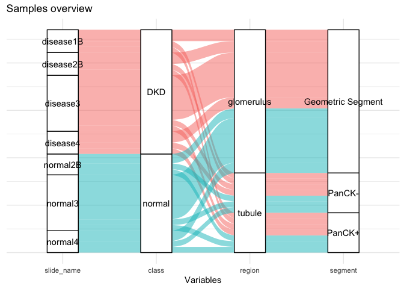<!-- -->

## QC & preprocessing

### 1. Segment QC

***Filtering Criteria***

- **Raw seq reads**: Segments with \< 1000 raw reads are removed.

- **%aligned, % trimmed**reads: Segments \<80% for any of this are
  removed.

- **%Sequence saturation** ($1-\frac{Unique\ reads}{Aligned\ reads}$%):
  Segments \< 50% require more reads and should not be analyzed.

- **Negative Count**: Geometric mean of unique negative probes of the
  panel that do not target mRNA but are to establish background count
  level per segment.

- **No template control (NTC) count**: Values \>1K are likely
  contamination for segments associated with this NTC. If value is
  between 1K to 10K segments can be used if NTC data is uniformly low
  (0-2 counts for all probes).

- **Nuclei**: \>100 nuclei per segment is recommended. Study dependent,
  the key is to notice consistency across the segments.

- **Area**: Tends to correlate with nuclei, not a strict cutoff.

``` r
geomxdt <- readRDS(file = file.path(out_dir,'env/geomxdt_raw.rds'))
## Initial transformations: Add count of 1 to all the counts. 
geomxdt <- shiftCountsOne(geomxdt, useDALogic = T) ## Make sure to remove 1 when saving counts matrix.
```

``` r
## If No Template Control count (NTC) is not there, and there are Negative Probes in the set, calculate NTC value.
protocolData(geomxdt)[['ProbeCounts']] <- colSums( exprs(geomxdt)) 

ix <- fData(geomxdt) %>% filter(grepl('Probe', TargetName))
if(nrow(ix) > 0){
  ## NTC = Counts in Negative probes.
   protocolData(geomxdt)[['NTC']] <- colSums( exprs(geomxdt)[ix$RTS_ID,]) 
   ## % of Negative Probe Counts / Counts in valid probes.
   ix <- fData(geomxdt) %>% filter(!grepl('Probe', TargetName))
   protocolData(geomxdt)[['NegProbe_pct']] <- (protocolData(geomxdt)[['NTC']] / colSums( exprs(geomxdt)[ix$RTS_ID,] ) ) * 100
}
```

``` r
# Default QC cutoffs are commented in () adjacent to the respective parameters
# study-specific values were selected after visualizing the QC results in detail
QC_params =
    list(minSegmentReads = 1000, # Minimum number of reads (1000)
         percentTrimmed = 80,    # Minimum % of reads trimmed (80%)
         percentStitched = 80,   # Minimum % of reads stitched (80%)
         percentAligned = 80,    # Minimum % of reads aligned (80%)
         percentSaturation = 50, # Minimum sequencing saturation (50%)
         minNegativeCount = 1.2,   # Minimum negative control counts (10)
         maxNTCCount = 10000,     # Maximum counts observed in NTC well (10000) -> Upper limit
         minNuclei = 50,       # Minimum # of nuclei estimated (100)
         minArea = 5000          # Minimum area of segment (1000) - Obligatory, otherwise it sets to a default threshold
)         

geomxdt = setSegmentQCFlags(geomxdt,  qcCutoffs = QC_params)        

# Collate QC Results
QCResults = protocolData(geomxdt)[["QCFlags"]]
QC_Summary = data.frame(Pass = colSums(!QCResults), Warning = colSums(QCResults))
QCResults$QCStatus <- apply(QCResults, 1L, function(x) {
    ifelse(sum(x) == 0L, "PASS", "WARNING")
})
QC_Summary["Total Flags", ] <-
    c(sum(QCResults[, "QCStatus"] == "PASS"),
      sum(QCResults[, "QCStatus"] == "WARNING"))

QC_Summary
```

    ##               Pass Warning
    ## LowReads       231       4
    ## LowTrimmed     235       0
    ## LowStitched    235       0
    ## LowAligned     229       6
    ## LowSaturation  231       4
    ## LowNegatives   229       6
    ## HighNTC        235       0
    ## LowNuclei      215      20
    ## LowArea        235       0
    ## Total Flags    207      28

If you have different cell types, use them as category for exploration
of QC, if not, then check it by slides. In this case, we will use the
segment variable, which is set to geometric segment for glomerulus, and
PanCK or neg for tubules (proximal or distal).

``` r
col_by <- "segment"

# Graphical summaries of QC statistics plot function
QC_histogram <- function(assay_data = NULL,
                         annotation = NULL,
                         fill_by = NULL,
                         thr = NULL,
                         scale_trans = NULL) {
    plt <- ggplot(assay_data,
                  aes_string(x = paste0("unlist(`", annotation, "`)"),
                             fill = paste0('(', fill_by,')') )) +
        geom_histogram(bins = 50) +
        geom_vline(xintercept = thr, lty = "dashed", color = "black") +
        theme_bw() + guides(fill = "none") +
        facet_wrap(as.formula(paste("~", fill_by)), nrow = 4) +
        labs(x = annotation, y = "Segments, #", title = annotation)
    if(!is.null(scale_trans)) {
        plt <- plt +
            scale_x_continuous(trans = scale_trans)
    }
    plt
}
```

#### Trimmed reads

``` r
QC_histogram(sData(geomxdt), "Trimmed (%)", col_by, QC_params$percentTrimmed)
```

    ## Warning: `aes_string()` was deprecated in ggplot2 3.0.0.
    ## ℹ Please use tidy evaluation idioms with `aes()`.
    ## ℹ See also `vignette("ggplot2-in-packages")` for more information.
    ## This warning is displayed once every 8 hours.
    ## Call `lifecycle::last_lifecycle_warnings()` to see where this warning was generated.

<!-- -->

#### Stitched reads

``` r
QC_histogram(sData(geomxdt), "Stitched (%)", col_by, QC_params$percentStitched)
```

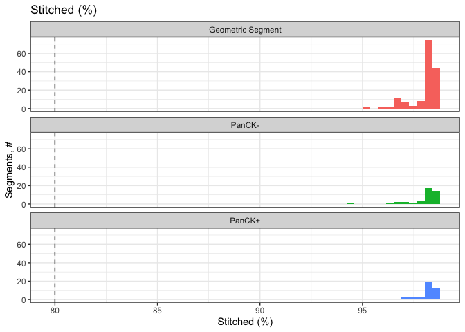<!-- -->

#### Aligned reads

``` r
QC_histogram(sData(geomxdt), "Aligned (%)", col_by, QC_params$percentAligned)
```

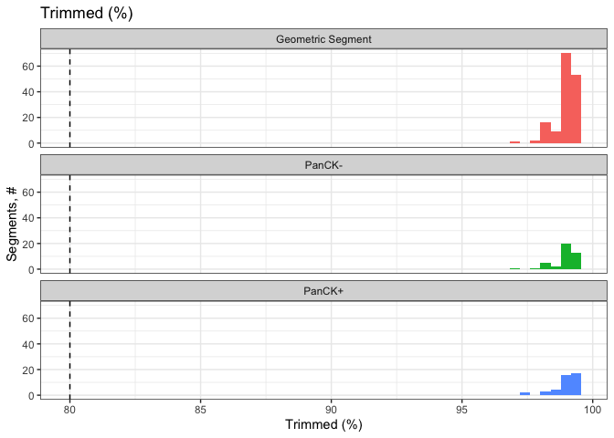<!-- -->

#### Sequence saturation

``` r
QC_histogram(sData(geomxdt), "Saturated (%)", col_by, QC_params$percentSaturation) +
    labs(title = "Sequencing Saturation (%)", x = "Sequencing Saturation (%)")
```

<!-- -->

#### Area and number of nuclei

When data is available, explore this variables, there should be
correlation between both, but all this should be guided by your
biological expectations (Cell type, tissue, phenotype)

#### Number of nuclei

``` r
QC_histogram(sData(geomxdt), "nuclei", col_by, QC_params$minNuclei) +
    labs(title = "Number of nuclei", x = "Number of nuclei")
```

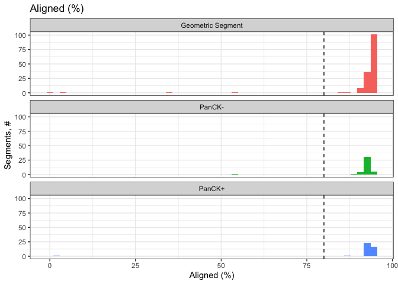<!-- -->

#### Segment area

When data is available for number of nuclei, explore this variables,
there should be correlation between both, but all this should be guided
by your biological expectations (Cell type, tissue, phenotype)

``` r
QC_histogram(sData(geomxdt), "area", col_by, QC_params$minArea, scale_trans = "log10") +
    labs(title = "Segment area", x = "Segment Area")
```

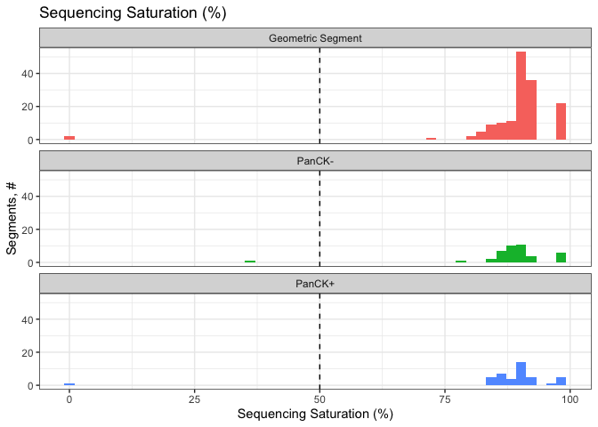<!-- -->

``` r
ggplot(sData(geomxdt), aes(x = nuclei, y = area, color = segment, shape = region)) + geom_point() + 
  scale_x_log10() + scale_y_log10() +
  theme_bw() + labs(title = 'Nuclei ~ area') 
```

#### NTC Count

In this case, we have multiple samples with NTC Counts above 1k, but in
most cases are below 10k.

``` r
QC_histogram(sData(geomxdt), "NTC", col_by, QC_params$maxNTCCount) +
    labs(title = "NTC: Negative Template Control counts", x = "NTC") + 
  geom_vline(xintercept = 10000, color = 'red3')
```

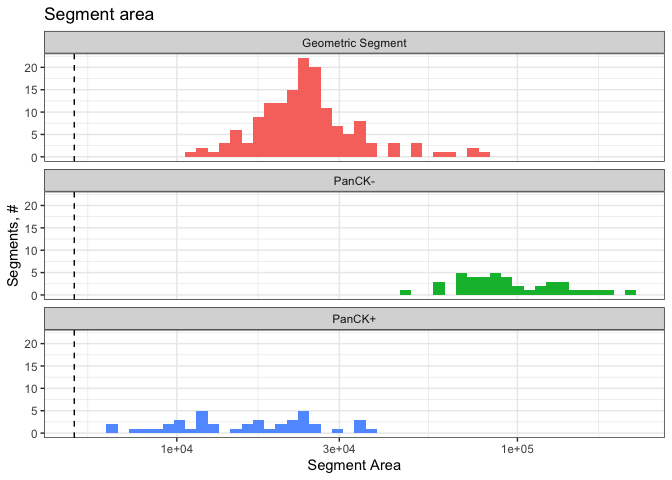<!-- -->

``` r
sData(geomxdt) %>% ggplot(aes(x = NTC, y = NegProbe_pct)) + geom_point() + theme_bw() + 
  labs(x = 'NTC', y = 'Neg Probe counts / Organism probe counts (%)')
```

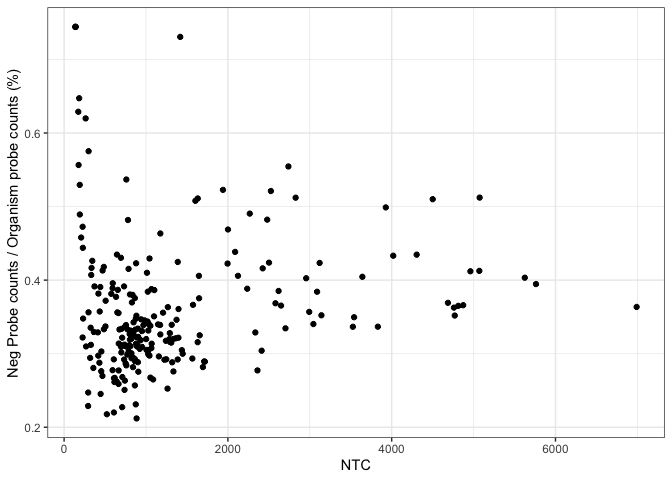<!-- -->

#### Geometric Means: Gene expression

Geometric Mean per segment, this is done by module (If more that I probe
panel used, each module represents a panel)

``` r
# calculate the negative geometric means for each module
negativeGeoMeans <- 
    esBy(negativeControlSubset(geomxdt), 
         GROUP = "Module", 
         FUN = function(x) { 
           ## Get Negative Geometric mean per segment.
             assayDataApply(x, MARGIN = 2, FUN = ngeoMean, elt = "exprs") 
         }) 
protocolData(geomxdt)[["NegGeoMean"]] <- negativeGeoMeans

# explicitly copy the Negative geoMeans from sData to pData
negCols <- paste0("NegGeoMean_", modules)
pData(geomxdt)[, negCols] <- sData(geomxdt)[["NegGeoMean"]]
for(ann in negCols) {
    plt <- QC_histogram(pData(geomxdt), ann, col_by, 1.5, scale_trans = "log10")
    print(plt)
}
```

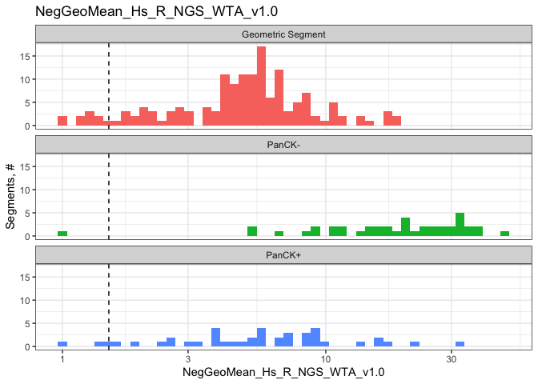<!-- -->

``` r
# detatch neg_geomean columns ahead of aggregateCounts call
pData(geomxdt) <- pData(geomxdt)[, !colnames(pData(geomxdt)) %in% negCols]
```

#### Segments statistics

``` r
knitr::kable(QC_Summary, caption = "QC Summary Table for each Segment")
```

|               | Pass | Warning |
|:--------------|-----:|--------:|
| LowReads      |  231 |       4 |
| LowTrimmed    |  235 |       0 |
| LowStitched   |  235 |       0 |
| LowAligned    |  229 |       6 |
| LowSaturation |  231 |       4 |
| LowNegatives  |  229 |       6 |
| HighNTC       |  235 |       0 |
| LowNuclei     |  215 |      20 |
| LowArea       |  235 |       0 |
| Total Flags   |  207 |      28 |

QC Summary Table for each Segment

### Filter dataset

Filter performed so we keep segments that PASS all the QC criteria and
also have a negative geometric mean greater than 1. In this case, the
initial data set went from 235 segments to 211.

``` r
dim(geomxdt)
```

    ## Features  Samples 
    ##    18815      235

``` r
## Index of segments QC: Check whether samples PASSED or add a flag instead of warning. 
## Add Flag: If it did not pass, flag is why. 
QCResults$Flag <- select(QCResults, -QCStatus) %>% 
  apply(1, function(x) ifelse(sum(x)==0,'PASS', paste(names(QCResults)[which(x)], collapse=',')))

## Gather the metadata for ALL samples, and add a FLAG about whether they passed or not. 
x <- sData(geomxdt) %>% dplyr::select(-FileVersion, -SoftwareVersion, -QCFlags) %>% rownames_to_column('segment_name')
for(i in which(map(x, ~class(.x)[1]) %in% c('data.frame', 'matrix'))){ x[[i]] = x[[i]][,1]  }
x <- cbind(x, select(QCResults, QCStatus, Flag))

write_tsv(x, file = file.path(out_dir,'results','segment_metadata_QC.tsv'))

## Filter by initial QC and also the negativeGeometricMeans per probe in each segment. 
geomxdt <- geomxdt[, QCResults$QCStatus == "PASS"]
# Subsetting our dataset has removed samples which did not pass QC
dim(geomxdt)
```

    ## Features  Samples 
    ##    18815      207

### 2. Probe QC

The goal is to remove low performance probes, which can be due to poor
hybridization, low specificity, or other technical issues. WTA libraries
have one probe per gene.

A probe should be removed if: \* Geometric mean of probe counts across
segments / geometric mean of all probe counts \< 0.1

``` r
geomxdt <- setBioProbeQCFlags(geomxdt, 
                               qcCutoffs = list(minProbeRatio = 0.1,
                                                percentFailGrubbs = 20), 
                               removeLocalOutliers = TRUE)

ProbeQCResults <- fData(geomxdt)[["QCFlags"]]

qc_df <- data.frame(Passed = sum(rowSums(ProbeQCResults[, -1]) == 0),
                    Global = sum(ProbeQCResults$GlobalGrubbsOutlier),
                    Local = sum(rowSums(ProbeQCResults[, -2:-1]) > 0
                                & !ProbeQCResults$GlobalGrubbsOutlier))

qc_df %>% knitr::kable(caption = 'Probes flagged or passed as outliers')
```

| Passed | Global | Local |
|-------:|-------:|------:|
|  18796 |      1 |    18 |

Probes flagged or passed as outliers

``` r
geomxdt <- 
    subset(geomxdt, 
           fData(geomxdt)[["QCFlags"]][,c("LowProbeRatio")] == FALSE &
               fData(geomxdt)[["QCFlags"]][,c("GlobalGrubbsOutlier")] == FALSE)
dim(geomxdt)
```

    ## Features  Samples 
    ##    18814      207

``` r
#> Features  Samples 
#>     18814      207
```

### 3. Gene-level count data

``` r
# Check how many unique targets the object has
length(unique(featureData(geomxdt)[["TargetName"]]))
```

    ## [1] 18677

``` r
#> [1] 18677

# collapse to targets
target_data <- aggregateCounts(geomxdt)
dim(target_data)
```

    ## Features  Samples 
    ##    18677      207

``` r
#> Features  Samples 
#>    18677      207

## Save raw tables: Counts, features + segment metadata
counts <- (exprs(target_data) - 1) %>% as.data.frame() %>% rownames_to_column('TargetName')
features <- fData(target_data)
sam_anno <- sData(target_data) %>% dplyr::select(any_of(meta_cols)) %>% rownames_to_column('segment_name') 
#for(i in which(map(sam_anno, ~class(.x)[1]) %in% c('data.frame', 'matrix'))){ sam_anno[[i]] = sam_anno[[i]][,1]  }

## Write tables to tsv. 
write_tsv(counts, file.path(out_dir,'results','raw_counts.tsv'))
write_tsv(features, file = file.path(out_dir,'results','raw_features.tsv'))
write_tsv(sam_anno, file = file.path(out_dir,'results','raw_metadata.tsv'))
```

### 4. Limit of quantification

Limit of quantification per segment, calculated on the distribution of
negative control probes, and is intended to approximate the quantifiable
limit of gene expression per segment. More stable in larger segments,
also not great for segments with low negative probe counts.

$LOQ=geomean(NegProbe)*geoSD(NegProbe)^n$ *, where n is normally equal
to 2.*

LOQ with a minimum of 2 as threshold.

``` r
# Define LOQ SD threshold and minimum value
cutoff = 2
minLOQ = 2

# Calculate LOQ per module tested
LOQ = data.frame(row.names = colnames(target_data))
for(module in modules) {
    vars <- paste0(c("NegGeoMean_", "NegGeoSD_"),
                   module)
    if(all(vars[1:2] %in% colnames(pData(target_data)))) {
        LOQ[, module] <-
            pmax(minLOQ,
                 pData(target_data)[, vars[1]] * 
                     pData(target_data)[, vars[2]] ^ cutoff)
    }
}
pData(target_data)$LOQ = LOQ
pData(target_data)$segment_name = rownames(pData(target_data))
```

### 5. Filtering

After determining the limit of quantification (LOQ) per segment, we
recommend filtering out either segments and/or genes with abnormally low
signal. Filtering is an important step to focus on the true biological
data of interest.

We determine the number of genes detected in each segment across the
dataset.

``` r
LOQ_Mat <- c()
for(module in modules) {
    ind <- fData(target_data)$Module == module
    Mat_i <- t(esApply(target_data[ind, ], MARGIN = 1,
                       FUN = function(x) {
                           x > LOQ[, module]
                       }))
    LOQ_Mat <- rbind(LOQ_Mat, Mat_i)
}
# ensure ordering since this is stored outside of the geomxSet
LOQ_Mat <- LOQ_Mat[fData(target_data)$TargetName, ]
```

#### Segment gene detection

We first filter out segments with exceptionally low signal. These
segments will have a small fraction of panel genes detected above the
LOQ relative to the other segments in the study. Let’s visualize the
distribution of segments with respect to their % genes detected:

``` r
# Save detection rate information to pheno data
pData(target_data)$GenesDetected <- 
    colSums(LOQ_Mat, na.rm = TRUE)
pData(target_data)$GeneDetectionRate <-
    pData(target_data)$GenesDetected / nrow(target_data)

# Determine detection thresholds: 1%, 5%, 10%, 15%, >15%
pData(target_data)$DetectionThreshold <- 
    cut(pData(target_data)$GeneDetectionRate,
        breaks = c(0, 0.01, 0.05, 0.1, 0.15, 1),
        labels = c("<1%", "1-5%", "5-10%", "10-15%", ">15%"))

# stacked bar plot of different cut points (1%, 5%, 10%, 15%)
ggplot(pData(target_data),
       aes(x = DetectionThreshold)) +
    geom_bar(aes(fill = segment)) +
    geom_text(stat = "count", aes(label = ..count..), vjust = -0.5) +
    theme_bw() +
    scale_y_continuous(expand = expansion(mult = c(0, 0.1))) +
    labs(x = "Gene Detection Rate",
         y = "Segments, #",
         fill = "Segment type")
```

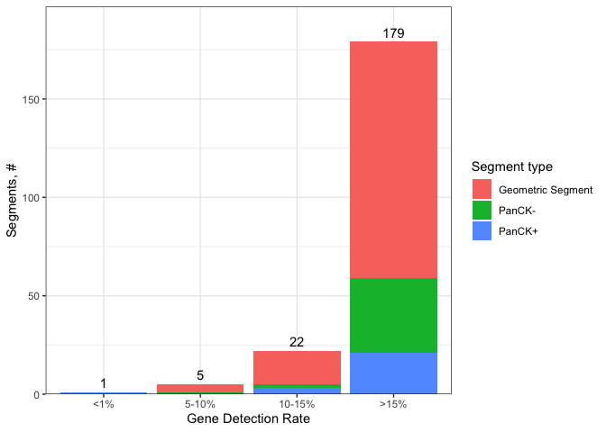<!-- -->

In this example, we choose to remove segments with less than 10% of the
genes detected. Generally, 5-10% detection is a reasonable segment
filtering threshold. However, based on the experimental design
(e.g. segment types, size, nuclei) and tissue characteristics
(e.g. type, age), these guidelines may require adjustment.

``` r
target_data <- target_data[, pData(target_data)$GeneDetectionRate >= .1]

dim(target_data)
```

    ## Features  Samples 
    ##    18677      201

``` r
count_mat = dplyr::count(sData(geomxdt), class, region, segment, slide_name) %>% 
  mutate(Slide = gsub('^.+ (S\\d)-.+$', '\\1', slide_name)) #%>% select(-slide_name)

## Current 
ggplot(count_mat, aes(x = Slide, y = n, fill = segment)) + 
  geom_bar(stat = 'identity') + facet_grid(~class, scales = 'free_x') +
  theme_bw() + labs(title = 'Samples overview (mouse*condition)') 
```

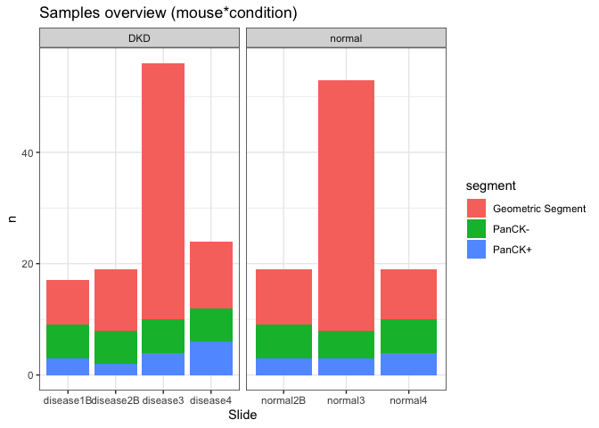<!-- -->

#### Gene detection rate

Next, we determine the detection rate for genes across the study. To
illustrate this idea, we create a small gene list (goi) to review.

We can see that individual genes are detected to varying degrees in the
segments, which leads us to the next QC we will perform across the
dataset.

``` r
# Calculate detection rate:
LOQ_Mat <- LOQ_Mat[, colnames(target_data)]
fData(target_data)$DetectedSegments <- rowSums(LOQ_Mat, na.rm = TRUE)
fData(target_data)$DetectionRate <-
    fData(target_data)$DetectedSegments / nrow(pData(target_data))
```

#### Gene filtering

We will graph the total number of genes detected in different
percentages of segments. Based on the visualization below, we can better
understand global gene detection in our study and select how many low
detected genes to filter out of the dataset. Gene filtering increases
performance of downstream statistical tests and improves interpretation
of true biological signal.

``` r
# Plot detection rate:
plot_detect <- data.frame(Freq = c(1, 5, 10, 20, 30, 50))
plot_detect$Number <-
    unlist(lapply(c(0.01, 0.05, 0.1, 0.2, 0.3, 0.5),
                  function(x) {sum(fData(target_data)$DetectionRate >= x)}))
plot_detect$Rate <- plot_detect$Number / nrow(fData(target_data))
rownames(plot_detect) <- plot_detect$Freq

ggplot(plot_detect, aes(x = as.factor(Freq), y = Rate, fill = Rate)) +
    geom_bar(stat = "identity") +
    geom_text(aes(label = formatC(Number, format = "d", big.mark = ",")),
              vjust = 1.6, color = "black", size = 4) +
    scale_fill_gradient2(low = "orange2", mid = "lightblue",
                         high = "dodgerblue3", midpoint = 0.65,
                         limits = c(0,1),
                         labels = scales::percent) +
    theme_bw() +
    scale_y_continuous(labels = scales::percent, limits = c(0,1),
                       expand = expansion(mult = c(0, 0))) +
    labs(x = "% of Segments",
         y = "Genes Detected, % of Panel > LOQ")
```

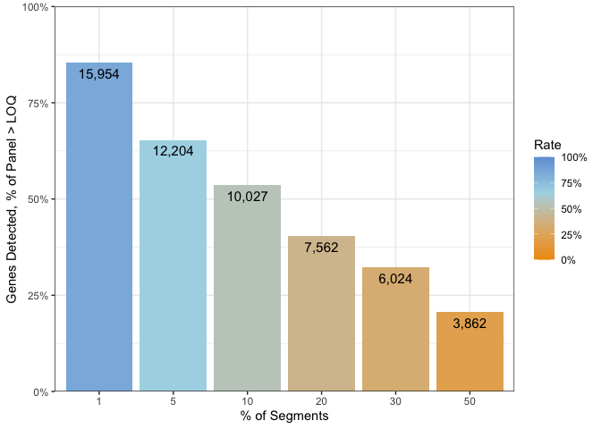<!-- -->

We typically set a % Segment cutoff ranging from 5-20% based on the
biological diversity of our dataset. For this study, we will select 10%
as our cutoff. In other words, we will focus on the genes detected in at
least 10% of our segments; we filter out the remainder of the targets.

Note: if we know that a key gene is represented in only a small number
of segments (\<10%) due to biological diversity, we may select a
different cutoff or keep the target gene by manually selecting it for
inclusion in the data object.

``` r
# Subset to target genes detected in at least 10% of the samples.
#   Also manually include the negative control probe, for downstream use
negativeProbefData <- subset(fData(target_data), CodeClass == "Negative")
neg_probes <- unique(negativeProbefData$TargetName)
target_data <- 
    target_data[fData(target_data)$DetectionRate >= 0.1 |
                        fData(target_data)$TargetName %in% neg_probes, ]
dim(target_data)
```

    ## Features  Samples 
    ##    10028      201

``` r
#> Features  Samples 
#>    10028      201
```

## Save Dataset

Save final tidy dataset as `NanoStringGeoMxSet`, also counts, features
and metadata tables as well as `SpatialExperiment` dataset.

``` r
saveRDS(target_data, file = file.path(out_dir, 'env','tidy_geomx_obj.RDS'))

## Save raw tables: Counts, features + segment metadata
counts <- (exprs(target_data) - 1) %>% as.data.frame() %>% rownames_to_column('TargetName')
features <- fData(target_data)
sam_anno <- sData(target_data) %>% dplyr::select(any_of(meta_cols)) %>% rownames_to_column('segment_name') 

## Write tables to csv. 
write_tsv(counts, file.path(out_dir,'results','tidy_counts.tsv'))
write_tsv(features, file = file.path(out_dir,'results','tidy_features.tsv'))
write_tsv(sam_anno, file = file.path(out_dir,'results','tidy_metadata.tsv'))

##########
## Save Spatial Experiment object.
#########
## Normalization -> Initial to save Spatial Experiment.- Q3
target_data <- normalize(target_data, 
                     fromElt = "exprs",
                     norm_method = "quant", 
                     desiredQuantile = .75,
                     toElt = "q_norm")


library(SpatialExperiment)
spe <- as.SpatialExperiment(target_data, normData = 'exprs')
assayNames(spe) <- 'counts' ## By default the function creates a GeoMx assay.
## Shuffle counts by 1 -> To ensure real counts by 1. 
assay(spe, 'counts') <- assay(spe, 'counts') -1 
assay(spe, 'normalized') <- assayDataElement(object = target_data, elt = "q_norm")
saveRDS(spe, file = file.path(out_dir, 'env','tidy_spe_obj.RDS'))
```

## Session information

``` r
map(sessionInfo()$otherPkgs, ~.x$Version)
```

    ## $ggalluvial
    ## [1] "0.12.5"
    ## 
    ## $SpatialExperiment
    ## [1] "1.12.0"
    ## 
    ## $SingleCellExperiment
    ## [1] "1.24.0"
    ## 
    ## $SummarizedExperiment
    ## [1] "1.32.0"
    ## 
    ## $GenomicRanges
    ## [1] "1.54.1"
    ## 
    ## $GenomeInfoDb
    ## [1] "1.38.8"
    ## 
    ## $IRanges
    ## [1] "2.36.0"
    ## 
    ## $MatrixGenerics
    ## [1] "1.14.0"
    ## 
    ## $matrixStats
    ## [1] "1.5.0"
    ## 
    ## $readxl
    ## [1] "1.4.3"
    ## 
    ## $lubridate
    ## [1] "1.9.4"
    ## 
    ## $forcats
    ## [1] "1.0.0"
    ## 
    ## $stringr
    ## [1] "1.5.1"
    ## 
    ## $dplyr
    ## [1] "1.1.4"
    ## 
    ## $purrr
    ## [1] "1.0.4"
    ## 
    ## $readr
    ## [1] "2.1.5"
    ## 
    ## $tidyr
    ## [1] "1.3.1"
    ## 
    ## $tibble
    ## [1] "3.2.1"
    ## 
    ## $tidyverse
    ## [1] "2.0.0"
    ## 
    ## $harmony
    ## [1] "1.2.3"
    ## 
    ## $Rcpp
    ## [1] "1.0.14"
    ## 
    ## $SeuratObject
    ## [1] "4.1.4"
    ## 
    ## $Seurat
    ## [1] "4.4.0"
    ## 
    ## $GeomxTools
    ## [1] "3.5.0"
    ## 
    ## $NanoStringNCTools
    ## [1] "1.10.1"
    ## 
    ## $ggplot2
    ## [1] "3.5.1"
    ## 
    ## $S4Vectors
    ## [1] "0.40.2"
    ## 
    ## $Biobase
    ## [1] "2.62.0"
    ## 
    ## $BiocGenerics
    ## [1] "0.48.1"
